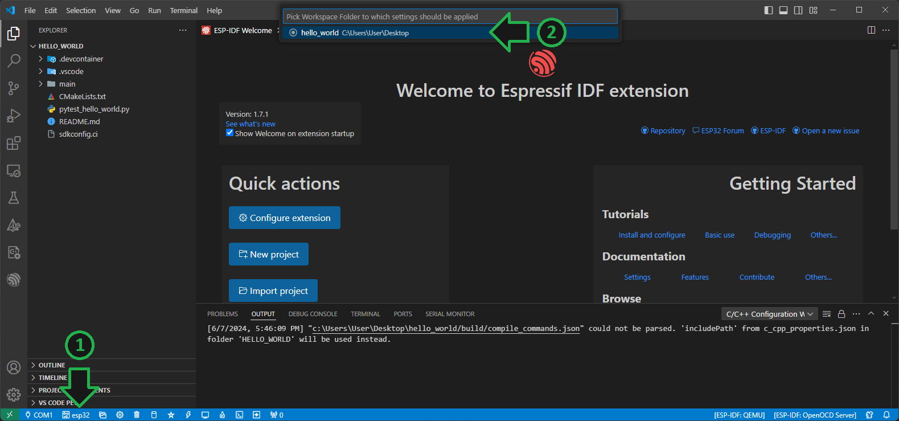
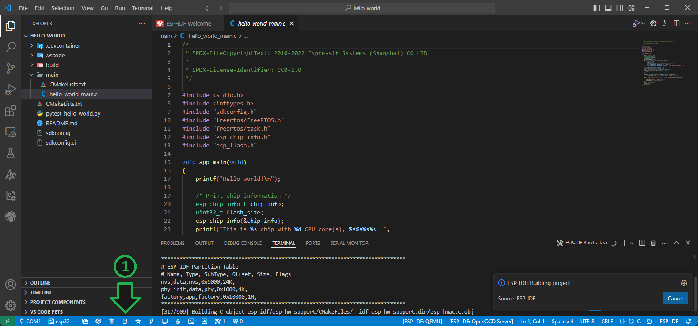

# Primer Ejemplo

A continuación se detallan los pasos la compilación, grabación y ejecución del primer ejemplo. 

1. [Carga de Ejemplo](#carga-de-ejemplo)
2. [Compilación](#compilación)
3. [Grabación](#grabación)
4. [Monitor Serie](#monitor-serie)

## Carga de Ejemplo

1. En la aplicación `VSCode`, seleccionar el menú "View" -> "Command Palette" y escribir `esp-idf example`.

    

2. Elegir la opción `ESP-IDF: Show Examples Projects`.

    

3. En la parte izquierda de la pantalla se listan todos los ejemplos disponibles. Seleccione el ejemplo `hello_world`. En la parte derecha de la pantalla se le mostrará una descripción del ejemplo. Haga click en `Create project using example hello_world` y seleccione una ubicación donde guardar la carpeta del proyecto.

    

4. Automáticamente se le abrirá el nuevo proyecto `hello_world`. Dentro de la carpeta del proyecto podrá encontrar:
    - .vscode: carpeta donde se guardan los archivos de configuración del proyecto.
    - main: carpeta dende se encuentra el código fuente del proyecto.
    - CMakelist.txt: archivo de configuración para la construcción del proyecto.
    - REDAME.md: archivo con la descripción del proyecto.
    - sdkconfig: archivo de configuración del software del fabricante.

    

5. Dentro de la carpeta `main` podrá encontrar el archivo `hello_world_main.c` con el código fuente del ejemplo.

    

## Compilación

1. Antes de compilar el ejemplo, es necesario configurar el dispositivo con el que se está trabajando. Para eso presione el botón  (`ESP-IDF: Set Espressif Device Target`) y luego haga click en el nombre del proyecto.

    

2. A continuación seleccione la placa con la que está trabajando. En caso de ser la placa recomendada para el curso (`ESP32-DevKitC`) seleccione primero `esp32` y luego `ESP-WROVER-KIT 3.3V`.

    

    

3. Para compilar el proyecto, presione el botón  (`ESP-IDF: Build project`). Aparecerá una notificación de que el proyecto está siendo compilado.

    

> [!NOTE]
> La primera compilación de un proyecto puede tomar varios minutos.

4. Una vez finalizada la compilación, el programa le mostrará en el terminal el porcentaje de memoria del microcontrolador que ocupará el proyecto.
Además se puede observar en la barra del Explorador que se ha creado una nueva carpeta `build/`, donde se almacenan todos los archivos resultado de la compilación.

    

## Grabación

1. Antes de realizar la descarga del programa a la placa, se debe configurar el puerto al que está conectada. Haga click en el botón  (`ESP-IDF: Select Port to Use`) y luego seleccione el puerto en el que la placa esé conectada.

    

> [!TIP]
> El número del puerto `COM` es asignado por su sistema operativo al momento de conectar la placa por primera vez, por lo tanto puede variar de un dispositivo a otro.

2. Presione el botón  (`ESP-IDF: Flash Device`) y luego seleccione la opción `UART`.

    

3. El programa comenzará con la descarga del programa.
Si se completa correctamente, podrá observar el mensaje `Flash Done` en la pestaña `OUTPUT`.

    

## Monitor Serie

El `ESP-IDF Monitor` permite imprimir por pantalla mensajes enviados desde el microcontrolador, que pueden ser de utilidad para la verificación del funcionamiento de un programa.
En el mismo se muestran los mensajes enviados utilizando las funciones `printf()` o `ESP_LOG()`.

1. Presione el botón  (`ESP-IDF: Monitor Device`). Se abrirá un nuevo terminal llamado `ESP-IDF monitor` donde se mostrarán los mensajes enviados.

    

Se podrá observar una salida como la que se muestra a continuación:

```PowerShell
.
.
.
I (277) app_start: Starting scheduler on CPU0
I (282) main_task: Started on CPU0
I (282) main_task: Calling app_main()
Hello world!
This is esp32 chip with 2 CPU core(s), WiFi/BTBLE, silicon revision v1.0, 2MB external flash
Minimum free heap size: 301236 bytes
Restarting in 10 seconds...
Restarting in 9 seconds...
Restarting in 8 seconds...
Restarting in 7 seconds...
.
.
.
```

> [!IMPORTANT]
> Al ejecutar el `Monitor` el microcontrolador se reinicia, por lo tanto los mensajes mostrados parten desde el inicio de la ejecución del programa grabado.
